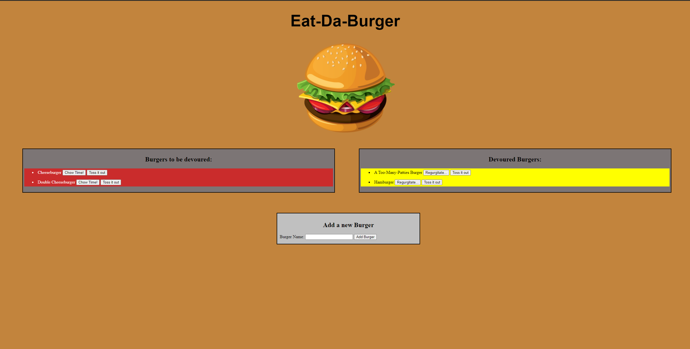

# The Employee Tracker 

## Description 
Experience the wonder of eating any burger without having to watch calories! You can add in your own burger type and it will be added to the database. Choosing to eat or regurgitate it will place it on either side of the screen and
dynamically change the value in that column of the database table.

Technologies used:
- JavaScript
- NodeJS
- Express
- MySQL
- Handlebars

## Table of Contents

* [Installation](#installation)
* [Usage](#usage)
* [Questions](#questions)
* [License](#license)

## Installation
Nothing needs to be installed!

## Usage 
Head over to https://infinite-mountain-31511.herokuapp.com/. Merely click on the buttons and watch the magic!

## Questions?

Visit me at my GitHub page: https://www.github.com/rgl10d

Or email me: rgl10d@gmail.com

## License

MIT License

Copyright © [2020] [Garrett Lee]

Permission is hereby granted, free of charge, to any person obtaining a copy
of this software and associated documentation files (the "Software"), to deal
in the Software without restriction, including without limitation the rights
to use, copy, modify, merge, publish, distribute, sublicense, and/or sell
copies of the Software, and to permit persons to whom the Software is
furnished to do so, subject to the following conditions:

The above copyright notice and this permission notice shall be included in all
copies or substantial portions of the Software.

THE SOFTWARE IS PROVIDED "AS IS", WITHOUT WARRANTY OF ANY KIND, EXPRESS OR
IMPLIED, INCLUDING BUT NOT LIMITED TO THE WARRANTIES OF MERCHANTABILITY,
FITNESS FOR A PARTICULAR PURPOSE AND NONINFRINGEMENT. IN NO EVENT SHALL THE
AUTHORS OR COPYRIGHT HOLDERS BE LIABLE FOR ANY CLAIM, DAMAGES OR OTHER
LIABILITY, WHETHER IN AN ACTION OF CONTRACT, TORT OR OTHERWISE, ARISING FROM,
OUT OF OR IN CONNECTION WITH THE SOFTWARE OR THE USE OR OTHER DEALINGS IN THE
SOFTWARE.